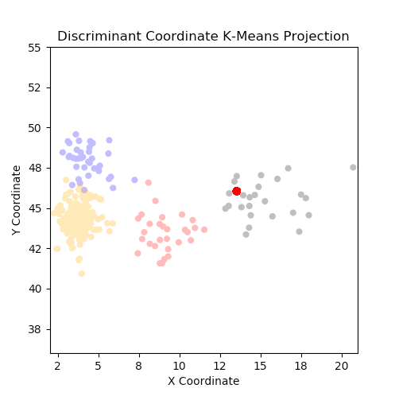

# Soundifying Clusters

# To view the movie, simply view the .avi file at the top with VLC or other compatible software.

# The aim of this project is to examine the underlying logic of clustering algorithms in a more accessible way.

To this end, I've created a video diagram which illustrates the results of a K-means cluster algorithm performed on a dataset of hundreds of songs. Each song is represented as a point on a 2-D plane, colored to indicate the cluster each song belongs to. The X and Y axes merely represent the coordinates to which the algorithm has mapped each point in relation to one another within the "cluster space".

# But what if we want to look further?

I recall from similar projects that BPM (beats per minute) and pitch-related features were especially important information for supervised learning algorithms. Could it be the case for clustering as well?

To find out, I represent tempo and tone with pitch and loudness respectively such that points on the graph with higher BPM play a higher-pitched note, and points with more of a particular note play a louder sound.

The graph gives preliminary support to the notion that BPM and tone are relatively important factors for algorithms to discern one cluster from another. Take for example the two leftmost clusters: while these two clusters are placed closely together, the top (blue) cluster plays sounds that are quieter than those in the bottom (orange) cluster, indicating that blue cluster songs contain more of a given note than orange cluster songs.

# Now I will explain the other files in the repo.

# beatsdataset.csv
This is the original dataset, from Kaggle, available [here.](https://www.kaggle.com/caparrini/beatsdataset)

# cluster_anim.py
I use numpy, pandas, and matplotlib to shape the data and create the video. Run this in your interactive Python terminal and you can replicate the video! I cannot show the audio portion as that was constructed with a professor's proprietary code. By default, this script will play the video rather than save it to your drive. If you would like to do that, change the flag at line 124 to 1. I have optimized the video for playback-- if you want to save a high-definition video like !cluster_anim_sound.avi please also use alternate code at lines 64 and 106.

# clusterdf.csv
This is a cleaned data file, for use with the above Python script.

# graphDist.py
A module for the python script.

# kmeans.R
This is the script which transforms beatsdataset to clusterdf. I use dplyr to clean the data and then perform cluster analysis. This is not needed as the resultant clean data file is provided in the repo already, unless you want to replicate.

